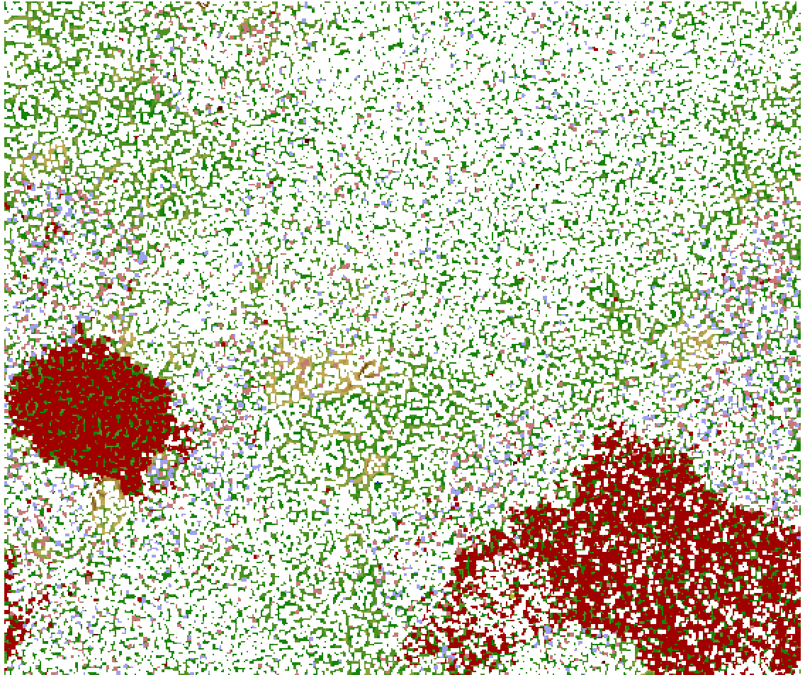

#From Raw Reads to Genomics
###### A story by Kevin Amses
***
##### You're going to need a grealakes login
* ask Tim about this if you don't have one yet
* which operating system are you using
  * Windows -> PuTTY terminal emulator, [setup instructions](https://arc-ts.umich.edu/greatlakes/user-guide/)
  * Mac -> Unix Terminal
  * Linux -> Unix Terminal
* Logging in:
  * Server: greatlakes.arc-ts.umich.edu
  * Username: [Umich uniqname]
  * Password: [Umich password]
* Getting around and doing things:
  * Use the GreatLakes cheatsheet that was handed out in lab meeting as a reference for basic Unix commands and job submission with Slurm
  * Or ask one of us!
  * When in doubt, `[program] -h` or `[program] --help` (e.g., `spades.py -help`
  * You should get two particular scripts from our server before starting `remove_small_contigs.pl` and `assemblathon_stats.pl`. I can give these to you, so just ask.

##### QC and Trimming
* Fastqc (I think you said you already had this done?
* [Trimmomatic](http://www.usadellab.org/cms/uploads/supplementary/Trimmomatic/TrimmomaticManual_V0.32.pdf) or [cutadapt](https://cutadapt.readthedocs.io/en/stable/guide.html) (both already on greatlakes)
  
  ```
  module load Bioinformatics trimmomatic
  module load Bioinformatics cutadapt
  ```
  
* Example `trimmomatic` Batch Script
  

```bash
### Slurm header stuff goes up here ###

module load Bioinformatics trimmomatic

cd /scratch/tyjames_flux/amsesk/rhop_neo/raw.data/combined_renamed

java -jar /home/amsesk/trimmomatic-0.36/trimmomatic-0.36.jar PE \
-threads 4 -trimlog log.txt /scratch/tyjames_flux/amsesk/\
rhop_neo/raw.data/combined_renamed/Neo1_R1.fastq /scratch/\
tyjames_flux/amsesk/rhop_neo/raw.data/combined_renamed/\
Neo1_R2.fastq ../adaptTrimmomatic/\
Neo1_forward_trimmed_paired.fastq ../adaptTrimmomatic/\
Neo1_forward_trimmed_orphan.fastq ../adaptTrimmomatic/\
Neo1_reverse_trimmed_paired.fastq ../adaptTrimmomatic/\
Neo1_reverse_trimmed_orphan.fastq ILLUMINACLIP:/home/amsesk/\
trimmomatic-0.36/adapters/NexteraPE-PE.fa:3:30:10
```

##### *de novo* Genome Assembly

* After trimming, it's time to assemble our short reads into contigs, representative of larger regions of the genome sequence. Since we don't have a reference genome, this is called *de novo* assembly. We're going to try to piece the thing together by aligning reads to eachother, making bigger and bigger contigs
* Use `SPAdes` (also already on greatlakes) - this can take awhile; [the manual](http://cab.spbu.ru/files/release3.12.0/manual.html)

```module load Bioinformatics spades```

* Example SPAdes Batch Script

```
#!/bin/bash
#SBATCH --job-name=round1_spades
#SBATCH --mail-type=BEGIN,END
#SBATCH --nodes=1
#SBATCH --ntasks-per-node=36
#SBATCH --mem-per-cpu=5g
#SBATCH --time=150:00:00
#SBATCH --account=tyjames
#SBATCH --partition=standard

module load Bioinformatics spades

cd /scratch/tyjames_root/tyjames/amsesk/scgid_pub/mock/round2

spades.py --sc --pe1-1 forward_reads.fastq --pe1-2 \
reverse_reads.fastq -m 180 -t 36 -o assembly \
-k 21,33,55,77,99 --phred-offset 33
```
This step can take awhile and depending on the size of your data, you might need to use one of the large memory computing nodes. But try it on a regular node first.

**Note** Check the `SPAdes` output directory once the job is finished. If you have a `contigs.fasta` file in there, then it worked!

Get assembly statistics by running:

```
perl /path/to/assemblathon_stats.pl contigs.fasta
```

This will print out a bunch of information about your assembly. Thinking like the number of contigs, cumulative length, GC content, etc. Check the N50 value to decide what your size cutoff should be for removing small contigs. For instance if my N50 is 1000 bp, I shouldn't be cutting off at 3000 bp - I would be tossing out tons of data.

Once you've decided:

```
perl /path/to/remove_small_contigs.pl [bp_cutoff] contigs.fasta > contigs.clip.[bp_cutoff].fasta
```

e.g.,

```
perl /path/to/remove_small_contigs.pl 500 contigs.fasta > contigs.clip.500.fasta
```

Ok, so now you have a draft genome assembly from your sequencing libraries. The path from here is a bit up to you depending on what you want to do. You can check for contamination and potentially refine your assembly using contamination removal techniques. There are a lot of these. Once you're happy with your assembly, you can continue on annotate and characterize it in  various ways.

### Assessing Assembly Contamination
There are many ways to computationally deal with contamination in both assemblies and reads. The first step is to figure out how bad it is. First we need to figure out what kind of contamination you have. If these contaminants have a published genome available, filtering can be done quite easily. If not, things are a bit harder. Let's go through some software that can help with this process. Remember, there are many options here.

#### Figuring out the identites of contaminants and the degree of contamination
We are particularly fond of using either Emergent Self-Organizing Maps (ESOMs) and GC-Coverage-Taxonomy plots to evaluate both of these things.

##### Emergent Self-Organizing Maps (ESOMs)

ESOMs applied here use the frequencies of tetramers (4bp kmers) to cluster contigs, generating a 2D topology with points representing parts of contigs (i.e., one contig has multiple points associated with it. This topology can be overlaid with taxonomic annotations from BLAST searches. ESOMs can be trained using [Databioincs ESOM Tools](http://databionic-esom.sourceforge.net/) in conjunction with some scripts provided in a [GitHub repository](https://github.com/tetramerFreqs/Binning) by Dick et al. You can use SCGid, a command-line program out of our lab, to train and annotate an ESOM topology. You can get it [here](http://www.github.com/amsesk/scgid) The basic pipline is like this:

```
# Train the ESOM with Databioincs ESOM Tools (slower, but less install needed)

scgid kmers train -n [contigs.fasta] -sr 50 -f [prefix_for_output] -w 1000 -m 1000 -mode det

# Train the ESOM with somoclu (faster, but install required)

scgid kmers train -n [contigs.fasta] -sr 50 -f [prefix_for_output] -w 1000 -m 1000 -mode s --cpus X

# Annotate the ESOM; -s option is "annotation scheme", which 
#determines colored annotation groupings. "/" separates groups and 
#"^" exludes subgroups for large taxonomic groups. So below 
#"Eukaryota^Fungi" means "Eukaryota except Fungi". Groups should be 
#exhaustive to ensure proper annotation.

scgid kmers annotate -n [contigs.fasta] -f [prefix_for_output] -s Bacteria/Archaea/Eukaryota^Fungi/Fungi --cpus X
```

Following training and annotation, the ESOM can be viewed locally on your computer by lodaing the `*.umx` or `*.wts` file into the Databioincs ESOM Tool GUI. Databioinics ESOM Tools allows you to actually "carve-out" contamination and generate post-filtering fastas without contaminating contigs. You can use `scgid kmers extract` to generate this FASTA after saving your sliced-up topology to a new `*.cls` file.

Here's an example ESOM topology:


##### GC-Coverage-Taxonmy Plot (GCTs)

GCTs can be made using various tools. Although I have not used it myself, [blobtools](https://github.com/DRL/blobtools) is the standard way to create and observe GCTs. You should look into how to install and use this.

SCGid also has an implementation of GCTs, although it's not as interactive as blobtools nor intended for viewing only (i.e., SCGid's implementation is for conducting actual filtering of the assembly based on GCTs). Here's how to run the SCGid implementation:

```
# Some of these options are not dicussed here, ask me

scgid gc-cov -n [contigs.fasta] -f [prefix_for_output] -g [target_taxonomy (one level)] --cpus X -sp [augustus_species]
```

Here's an example of an SCGid-generated GCT:


GCT plots can be used to determined cut-offs along either the GC or coverage axis, functionally allowing you to slice out clusters of contigs. SCGid was written to do this automatically for you.

##### Hard filtering with a reference genome
If you have a reference genome for your contaminant, you can use read mappers to map your raw reads to the reference, keeping only those that don't map. There are several read mappers you can use, but my favorite is BWA-MEM. It's run like so:

```
# Create an index from the reference fasta
bwa index [fasta]

# Map reads to the reference index
bwa mem -t [n CPUs] -a [index_prefix] [forward_reads] \
[reverse_reads] > [output_sam]

# Use SAM flags to pull out reads that did not map
samtools view -f 141 -c [output_sam] > [put_target_forward_reads.sam]
samtools view -f 77 -c [output_sam] > [put_target_reverse_reads.sam]

# Reassemble fastq file from SAM
### I have to locate this script for you, or write you a new one
```
### Genome Annotation

#### Predict Proteins

`augustus` (installed but not working - email sent to HPC), 
`maker` (needs to be installed)

#### Predict Protein Function

`dbCAN` - carbohydrate-active enzyme database, user `hmmer` to identify proteins that have CAZY-domains
`MEROPS` - protease database, `BLAST` or use `hmmer`
`interproscan` - needs to be isntalled; annotate proteins with predicted functional domains
`KEGG-maps` - online interfaces - submit your protein models to
`orthofinder` - installed on greatlakes already; find orthologs between a set of genomes
